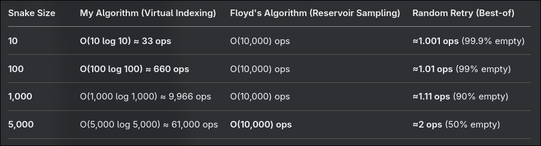

# Featurelist

## Game Mechanics
- Toggling walls on/off  Walls will show up on the edge of the board if enabled

## Project Structure
### OOP-Principles
- Encapsulation, fields are never public, only available through getters and setters
- Inheritance + Polymorphism, `AbstractEntity` includes some base logic, `SnakePartEntity`, `FoodEntity`, `WallEntity` and others contain specific logic for their type
- Simple form of dependency injection (`SnakeGame` handles initializing of all classes and passes down references if needed for example for the `Renderer`)
- Single Responsibility Principle for pretty much all classes

### Design Patterns
- Factory Pattern for `GameSettings` and creation of some other objects (e.g.: `Point2D`)
- Strategy Pattern in form of `AbstractRenderer` can easily be swapped out for a different renderer.  Used for open world mode for example
- Observer Pattern for `SnakeGame`, events are emitted, where the controller of the UI can subscribe to different events to trigger according UI changes.
- Command Pattern for different events happening in the game (Entities which are consumed will trigger different events)

## Performance (see design decisions below)
- [Food spawning](#food-spawning)
- [Efficient Rendering](#efficient-rendering)

# Design Decisions

## Food Spawning
I compared 3 different approaches
- Custom Function
- Floyd's Algorithm
- Random Spawning (brute force)

### Custom Function
Basically the idea is to gather the position of all parts of the snake (unique per position and sorted after their position) and then generate an integer value between `0 - (fieldsize - differentSnakePositions)` and for each snake part where the integer equivalent of its positions is less than or equal to the generated value, we increment the value by 1. When the first snake position is greater than the food pos, we can break the loop. Now it ensured, that the value is not on a snake field.

### Floyd's Algorithm
The idea behind Floyd's algorithm is, that we create a list of available cells and take a random position from that list. 
The list is created by filling a list with all possible positions and remove the occupied positions by the snake (or other entities).

### Random Spawning (brute force)
The most basic approach: generate a new position, untile no entity has the same position. 
Easy to do, but feels wrong to do so. Will also get more inefficient the entites are on the field.

### Performance Comparison
Here we can see the performance of the different approaches for a field of 100x100 cells. 
We can see that the random generation is very efficient for almost all cases, Floyd's algorithm will outperform random generation if the field is filled with more than 99% of elements.
My algorithm is not bad for a low field population, however it will fall of at a field filled around 10%. 

### Final implementation
In the end I decided for an approach similar to Floyd's algorithm, however, I won't create a list with all empty field each time I want to spawn a new food, instead the entity manager will keep track of them while registering/unregistering entities. 
This will give us the performance of Floyd's algorithm with less overhead, however the memory consumption might rise a bit while running the game.

Brute-forcing the food position might be the most efficient way, however it feels wrong to do so.

## Efficient Rendering
